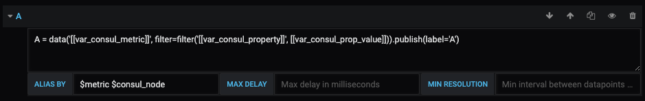

# SignalFX Grafana Datasource Plugin

## Adding the data source to Grafana


| Name	         | Description |
|----------------|-------------|
| _Name_         | The data source name is how you refer to the data source in panels & queries. |
| _Default_      | The default data source is pre-selected in new panels. |
| _Endpoint_	     | Endpoint is the URL of the SignalFlow API endpoint. |
| _Access Token_ | The SignalFx API access token. |


## Metric Query Editor



### Alias Patterns
* $label = The label used in the SignalFlow program.
* $metric = The metric name.
* $somename = The value of the ``somename`` property or dimension.
* You can also use [[somename]] pattern replacement syntax.

Examples:
```
$label $application_name [[port]]
```

## Templating

Instead of hard-coding things like server, application, and sensor name in you metric queries you can use template variables in their place. Select template variables from the dropdowns at the top of the dashboard. These template variable dropdowns make it easy to change the data displayed in your dashboard.

Checkout the [Templating](https://grafana.com/docs/reference/templating/) documentation for an introduction to the templating feature and the different types of template variables.

### Query Variables

Query variables allow you to query SignalFx for a list of metrics, tags, property keys or property values. 
The SignalFx Datasource Plugin provides the following functions you can use in the Query input field in the Variable edit view.

| Name                                           | Description                                                          |
|------------------------------------------------|----------------------------------------------------------------------|
|    _metrics(filter)_                             | List metrics based on name pattern, e.g. ``metrics(instance/disk/*)``.      |
|    _property\_keys(metric,[filter])_           | List property keys based on metric name and optional filter, e.g. ``property_keys($var_consul_metric,con)``. |
|    _property\_values(metric,property,[filter])_| List property values basen on metric name, property name and optional filter, e.g. ``property_values($var_consul_metric, $var_consul_property)``. |
|    _tags(metric,[filter])_                              | List tags matching the given pattern, e.g. ``tags(*cpu*,kafka)``. |

### Using Variables in Queries

Examples:
```
A = data('[[var_consul_metric]]', filter=filter('[[var_consul_property]]', '[[var_consul_prop_value]]')).publish(label='A')
```

```
A = data('Latency', filter=filter('stat', 'mean'), rollup='latest').$aggregation().publish(label='A')
```
## Installation

Copy the ``dist`` directory into your grafana plugins directory, e.g. /var/lib/grafana/plugins/signalfx-datasource.
