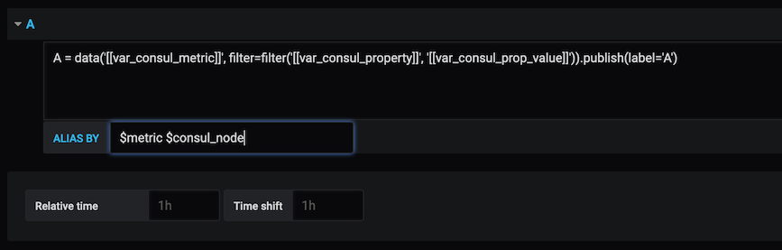

>ℹ️&nbsp;&nbsp;SignalFx was acquired by Splunk in October 2019. See [Splunk SignalFx](https://www.splunk.com/en_us/investor-relations/acquisitions/signalfx.html) for more information.

# SignalFx Grafana Datasource Plugin Setup

## Installation

Copy the ``dist`` directory into your grafana plugins directory. The default location is /var/lib/grafana/plugins/signalfx-datasource.

## Adding the SignalFx datasource to Grafana

After installing the SignalFx plugin on the Grafana server, click the Grafana icon on the desktop. In the side menu, click Configuration > Data Sources > Add Data Source. From the Type selection dropdown, click SignalFx.

The Settings tab in the Data Sources dialog box is shown below. Enter the settings in the table below to setup the plugin.


| Name	         | Description |
|----------------|-------------|
| _Name_         | The datasource name used in queries and displayed in panels. |
| _Default_      | Click if you want the datasource name pre-selected for new panels. |
| _Endpoint_	   | The URL of the SignalFlow Streaming Analytics endpoint for your realm. You will find your realm id and this URL on the [My Profile](https://docs.signalfx.com/en/latest/getting-started/get-around-ui.html#profile) page in the SignalFx UI.|
| _Access_       | Browser (default) = Calls to SignalFx will be made from the browser, Server = Calls to SignalFx will be proxied through the Grafana backend/server.  |
| _Access Token_ | The SignalFx Access Token (Org Token). See the [SignalFx Developer Guide](https://docs.signalfx.com/en/latest/admin-guide/tokens.html#working-with-access-tokens) for more details on Access Tokens. |

Click __Save and Test__.

### Browser Access Mode

All requests will be made from the browser directly to the SignalFx API. The SignalFx Access Token will transmitted from the Grafana backend/server to the browser and then from the browser to the SignalFx API in an unencrypted form and can be easily extracted by users who can access Grafana.

### Server Access Mode

All requests will be made from the browser to the Grafana backend/server which in turn will forward the requests to the SignalFx API. Once saved and encrypted by Grafana, the SignalFx Access Token will not be transmitted to the browser in any form. Because the requests are proxied through the Grafana backend/server, using Server Access Mode will incur additional centralized processing burden for every active chart.

## Provisioning the SignalFx datasource using config files

```yaml
apiVersion: 1
datasources:
- name: SignalFX
  type: signalfx-datasource
  access: direct
  jsonData:
     accessToken: XXX
  url: https://stream.signalfx.com
```

# Using SignalFx with Grafana

## Metric Query Editor

Configure the query editor by entering the variables described below.



### Alias Patterns
* $label = The label used in the SignalFlow program.
* $metric = The metric name.
* $somename = The value of the ``somename`` property or dimension.
* You can also use ``[[somename]]`` pattern replacement syntax.

Example:
```
$label $application_name [[port]]
```

## Templating

Use template variables rather than hard-coding server, application, and sensor names in your metric queries. Variables are shown as dropdown selection boxes at the top of the dashboard. These dropdowns makes it easy to change the data being displayed in your dashboard.

Check out the [Templating documentation](https://grafana.com/docs/reference/templating/) for an introduction to the templating feature and the different types of template variables.

### Query Variables

Query variables let you query SignalFx for a list of metrics, tags, property keys, or property values.
The SignalFx Datasource Plugin provides the following functions you can use in the Query input field of the Variable edit view.

| Name                                           | Description                                                          |
|------------------------------------------------|----------------------------------------------------------------------|
|    _metrics(filter)_                             | Lists metrics based on name pattern, e.g. ``metrics(instance/disk/*)``.      |
|    _property\_keys(metric,[filter])_           | Lists property keys based on metric name and optional filter, e.g. ``property_keys($var_consul_metric,con)``. |
|    _property\_values(metric,property,[filter])_| Lists property values based on metric name, property name, and optional filter, e.g. ``property_values($var_consul_metric, $var_consul_property)``. |
|    _tags(metric,[filter])_                              | Lists tags matching the specified pattern, e.g. ``tags(*cpu*,kafka)``. |

#### Examples
##### Single-Value Variables

A variable will be interpolated as a single value as long as neither the "Multi-value" nor the "Include All option" switch is turned on.


You can use single-value variables in queries as shown in the examples below.
```
A = data('[[var_consul_metric]]', filter=filter('[[var_consul_property]]', '[[var_consul_prop_value]]')).publish(label='A')
```

```
A = data('Latency', filter=filter('stat', 'mean'), rollup='latest').$aggregation().publish(label='A')
```

#### Multi-Value Variables

You can use multi-value variables in queries as shown in the examples below.
```
A = data('metric_name', filter=filter('property_name', [[var_consul_prop_multi_value]])).publish(label='A')
```

Values will be automatically formatted as ``'host1', 'host2'`` i.e. each value will ba surrounded with apostrophes and separated with commas.

### Max Delay
SignalFx sets the Max Delay parameter based on estimates of how ‘on time’ the time series are. By default, SignalFx detects and applies a reasonable value automatically, based on how your data is coming in.

If you know that some of your data is being delayed, and you don’t want to wait for that data to arrive before your charts are updated, then you can set max delay accordingly. 

To specify your own values, enter the number in milliseconds; e.g. enter 2000 to specify a max delay of 2 seconds. The upper limit is 15 minutes (900000 ms) but values over 5 minutes are generally not recommended. 

### Min Resolution

Specifies the minimum interval for which SignalFx should roll up values to display a datapoint on the chart. 

To specify your own values, enter the number in milliseconds; e.g. enter 900000 to specify a min resolution of 15 minutes.

## Building from source

Run `make clean dist` to build the plugin from scratch.
